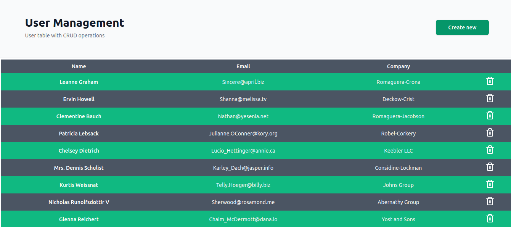

# User Management Application

This is a User Management Application built with **React.js**, **TailwindCSS**, **Shadcn**, and **TypeScript**. It provides a simple and responsive interface for managing users with CRUD (Create, Read, Update, Delete) operations.

## Live Demo

You can view the live version of the application at:

[Live URL](https://synergy-assignment-eight.vercel.app/)

## Features

- **Create User:** Add new users with details such as name, email, and role.
- **Read Users:** Display a list of all users in a responsive table.
- **Update User:** Edit and update existing user details.
- **Delete User:** Remove users from the system.
- **Responsive UI:** Fully responsive design using TailwindCSS.
- **Elegant UI Components:** Custom-built components using Shadcn and TypeScript.

## Tech Stack

- **React.js**: JavaScript library for building user interfaces.
- **TypeScript**: Typed superset of JavaScript.
- **TailwindCSS**: Utility-first CSS framework for styling.
- **Shadcn**: Custom component system built with Radix Primitives.
- **Vite**: Fast build tool for modern web development.

## Screenshots



## Getting Started

Follow the instructions below to set up the project locally.

### Prerequisites

Make sure you have the following installed:

- [Node.js](https://nodejs.org/) (v14.x or higher)
- [Yarn](https://yarnpkg.com/) or [npm](https://www.npmjs.com/)

### Installation

1. **Clone the repository:**

  ```bash
   git clone https://github.com/SunnyKumar107/synergy-assignment
   cd synergy-assignment
   ```

2. **Install dependencies.**

  ```bash
   npm install
   or 
   yarn install
   ```

3. **Run the project.**
   
  ```bash
   npm run dev
   or 
   yarn run dev
   ```